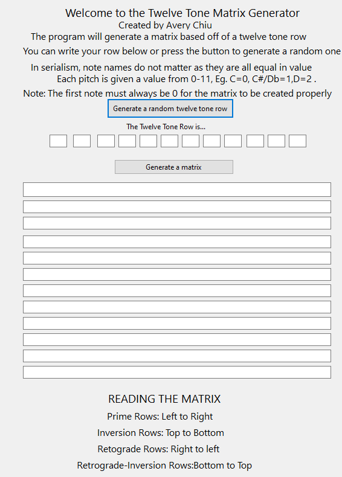

# Twelve Tone Matrix Generator
This program generates twelve tone rows and matrices. This is a style of music called serialism which was developed mainly by
Arnold Schoenberg. It was developed in the early 20th century. The Second Vienniese School of composers used this heavily in their music. This music is formed with the use of twelve tone rows, these rows consist of all 12 notes of the chromatic scale. Notes cannot be repeated in a twelve tone row, and all notes (in western music) must be used before creating a new row. The matrix shows different inversions and retrogrades of that row. This means the notes are either flipped, played in reverse, or both.

Sources  
https://en.m.wikipedia.org/wiki/Twelve-tone_technique  
https://en.wikipedia.org/wiki/Serialism

